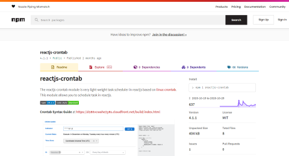

# 리액트 오픈소스 제작 

#### [Link To Library](https://www.npmjs.com/package/reactjs-crontab)

Client-side Job Scheduling을 위해 제작한 리액트 오픈소스 라이브러리입니다.
많은 애플리케이션에서 Crontab (Job Scheduling) 기능을 필요로 한다는 것을 알게 되었고 오픈소스 형태로 제작해 NPM 커뮤니티에 기여하였습니다

- 역할: Founder & Maintainer
- 개발 기간: 2020.10 ~ 2021.02
- 유지보수 기간: 2021.02 ~ 2021.12
- 사용 가능 브라우저: Chrome, IE, Firefox, Safari, Edge

프로그램에 관한 상세 내용은 [다큐멘테이션](https://www.npmjs.com/package/reactjs-crontab)을 참고 바랍니다.
